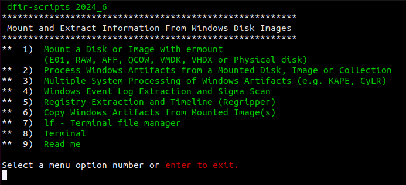

# Siftgrab

<div align="left">
 <p>
    
 </p>
</div>
https://github.com/dfir-scripts<br>
https://hub.docker.com/u/dfirscripts

Siftgrab is an automation script written in Bash that simplifies the process of parsing Windows forensic artifacts from Linux. It is wrapper for various open-source forensic tools and facilitates the mounting and extraction of forensic data from Windows systems.<br><br>
Siftgrab runs on Ubuntu 22.04 in a VM or standalone, alternatively it can be installed as a [Docker Image]( https://hub.docker.com/u/dfirscripts).

It provides easy access to different open source Linux forensic tools and custom scripts. It runs without having to separately locate download, install, or remember different command line options.

It can also be used at scale to process multiple data collections at once from tools like Kape and CyLR.

You can find a walk-through of the Siftgrab process here:

https://www.sans.org/blog/up-and-running-with-siftgrab/

The latest version outputs a number of custom [Excel spreadsheets](https://github.com/dfir-scripts/csv2XLsheet/tree/main/templates) to assist in analysis.
There is also a new submenu for easy access to extended artifact and memory parsing options.

### Installation Option 1:
**Install script**<br>
To install all tools and dependencies, run the following commands:
(Recommended installation is using fresh installation of Ubuntu 22.04 VM or WSL.  The install script works on Kali with some limitations. For full best results use the Docker install)<br>
<b>Note:</b> WSL 2 has file system performance issues which may cause it to run [slower](https://github.com/microsoft/WSL/issues/9430) <br>
Consider WSL 1 or VM/Docker installs if speed is an issue. 

INSTALLATION:
Run the following commands from the terminal.
```sh
wget https://raw.githubusercontent.com/dfir-scripts/installers/main/install-forensic-tools.sh
sudo chmod 755 install-forensic-tools.sh
sudo ./install-forensic-tools.sh
```

### Installation Option 2:
**Docker Install**<br>
Download and install latest version from Dockerhub and run.  The Siftgrab menu loads automatically.<br>
NOTE: Use -v parameter to provide access to mount points and output folders outside of docker image.<br>
  ```sh
  sudo docker pull dfirscripts/siftgrab:latest
  sudo docker run -it -v /mnt:/mnt -v /cases:/cases dfirscripts/siftgrab
```


### Siftgrab Menu:<br>
<div align="left">
 <p>
    
 </p>
</div>

  To access the siftgrab menu simply type:<br> 
  ```
sudo siftgrab
```
<b>Menu Options Detail</b><br>
<b>1) Mount a Disk or Image with</b> [ermount]( https://github.com/dfir-scripts/EverReady-Disk-Mount)<br>

       Basic disk mounting (ermount) can be performed using siftgrab menu selection 1
       or by running the ermount command from the terminal.
       When using the Docker, mount disks before running the
       docker image to allow access to mount points and provide output locations.
       ********************************************************
       EverReady Disk Mount
       Mount/umount disk and disk images
       (E01, vmdk, vhd(x), vdi, raw, iso, hfs+, qcow2 and vss)

       USAGE: /usr/local/bin/ermount [-h -s -u -b -rw] -i  \
       <Image file or Disk> -m <Mount Point> -t <File System Type>

       OPTIONAL:
           -i Image file or disk source to mount
           -m Mount point (Default /mnt/image_mount)
           -t File System Type (Default NTFS)
           -h This help text
           -s ermount status
           -u umount all disks from /usr/local/bin/ermount mount points
           -b mount bitlocker encrypted volume
           -rw mount image read write
       ********************************************************

   <b>2)  Analyze Windows Artifacts: Mounted Disk, Image or Collections(e.g. KAPE, CyLR)</b><br>
       Once Windows file artifacts are readable (mounted disk or artifact collection) they can be processed using selection 2.

        IMPORTANT NOTE: Artifacts must be located in their original path!
        (example: registry files <source_path>/Windows/System32/config)

        Menu selection #2 prompts for the following information:
               Image source root directory: (default /mnt/image_mount)
               Output Destination Directory: (default /cases).

        If data exists and can be parsed, output will be created for different data types:
<b>3)  Analyze Windows Artifacts Collected from Multiple Systems (e.g. KAPE, CyLR)</b><br>
       - Recursive results using same process as selection 2<br>
       - Source path is the Directory holding unzipped collections<br>
       - Example of source data:<br>
          ```    /mnt/hgfs/USB/R&D
          ```<br>-Each system's root path is similar to extracted Kape/CyLR collections<br>
               ```    /mnt/hgfs/USB/R&D/RD_System1/C```<br>
               ```    /mnt/hgfs/USB/R&D/RD_System2/C```<br></b>
<b>4)  Extract Windows Eventlogs to jsonl and Sigma Scan using Hayabusa</b><br>
       -Extracts Windows Event Logs to jsonl, run Hayabusa and several parsers.<br>
       -Outputs to a destination named WindowsEventLogs<br><br>
<b>5)  Analyze Windows Registry</b><br>
       -Runs Regripper and Regtimeline on Windows registry files.<br>
       -Output goes to a directory using the computer name in the system registry<br><br>
<b>6)  Save a copy of Windows Artifacts</b><br>
       -Save a Gzipped copy of common Windows Artifacts from a mounted data source<br><br>
<b>7)  lf - Terminal file manager</b><br>
       -Launch lf file system browser<br><br>
<b>8)  Additional Parsers and Memory Analysis (Sub Menu)</b><br>
** <b>1)  Evtxtract</b> (Carve binary files for Windows Event Logs)<br>
** <b>2)  ntfs_parser</b> (Deep parsing of MFT,USNJRNL,Logfile,INDX)<br>
** <b>3)  bulk_extractor</b> (Image and DMP file artifact extraction)<br>
** <b>4)  Didier Stevens Tools</b> (oledump, pdftool many parsers and decoders)<br>
** <b>5)  Volatility 3.0</b> (Memory image analysis)<br>
** <b>6)  Memprocfs</b> (Mount and analyze Windows memory images)<br>
** <b>7)  BMC-Tools</b> (Carve RDP Image Tiles from RDP Cache)<br>
** <b>8)  Vinetto</b> (Extract Thumbnail Cache)<br>
** <b>9)  Yarp + Registryflush</b> (Merge registry hives with transaction logs)<br>
** <b>10) EventTranscriptParser.py</b> (Parse Eventranscript.db)<br>

<b>9)  Terminal</b><br>
       -Access terminal from menu<br><br>
<b>10) Read me</b><br>
       -View the readme file<br><b>

### Results<br>
Results can be reviewed from Siftgrab using lf file browser or from Windows using preview programs like [Quicklook](https://github.com/QL-Win/QuickLook). Results are mainly csv and json so they can easily be searched and reviewed using grep, jq, excel or search tools like [Agent Ransack](https://www.mythicsoft.com/agentransack/). 
<div align="left">
 <p>
    
 </p>
</div>
https://github.com/dfir-scripts<br>
https://hub.docker.com/u/dfirscripts

Triage Output:
By default output data goes to the /cases directory but can be sent to a network share 
Output is sorted by artifact category:
```
./All_Summary
./All_Slicers
./Alert
./AlternateDataStreams
./Amcache
./BITS
./Browser_Activity
./Deleted_Files
./EventTranscript
./LNK
./LogFile
./lolbas
./MFT
./PCA
./PowerShell
./Prefetch
./RDP
./Registry/Impacket
./Registry/Regripper
./Registry/yarp-registryflush.py
./SRUM
./ScheduledTasks
./Services
./Timeline
./USB
./UserAccessLog
./Volatile
./WinActivitiesCache
./WindowsEventLogs
./WMI
```
### Installation Detail:<br>
  Directory creation:<br>
    The following directories are created:
```
     /mnt/raw
     /mnt/image_mount
     /mnt/vss
     /mnt/shadow
     /mnt/bde
     /mnt/smb
     /cases
     /usr/local/src
     /opt/app/
```
  #### Partial List of Installed Tools:<br>

    From Gift PPA: (Not available for Kali)
      libscca libewf-tools libbde-tools libvshadow-tools libesedb-tools liblnk-tools
      libevtx-tools plaso-tools bulk-extractor

    From Python PIP:
      python-evtx python-registry usnparser tabulate regex iocextract oletools bits_parser pandas construct

    From Github:
      https://github.com/mthcht/awesome-lists
      https://github.com/ANSSI-FR/bmc-tools
      https://github.com/msuhanov/yarp
      https://github.com/msuhanov/dfir_ntfs
      https://github.com/dkovar/analyzeMFT
      https://github.com/fireeye/BitsParser
      https://github.com/dfir-scripts
      https://github.com/keydet89/Tools
      https://github.com/obsidianforensics/hindsight
      https://github.com/davidpany/WMI_Forensics
      https://github.com/volatilityfoundation/volatility3
      https://github.com/kacos2000
      https://github.com/DidierStevens/DidierStevensSuite
      https://github.com/brimorlabs/KStrike
      https://github.com/MarkBaggett/srum-dump
      https://github.com/salehmuhaysin/JumpList_Lnk_Parser
      https://github.com/wagga40/Zircolite
      https://github.com/stuxnet999/EventTranscriptParser
      https://github.com/Silv3rHorn/4n6_misc
      https://github.com/williballenthin/python-registry
      https://github.com/omerbenamram/evtx
      https://github.com/omerbenamram/mft
      https://github.com/Yamato-Security/hayabusa
      https://github.com/gokcehan/lf
      https://cert.at/de/downloads/software/software-densityscout
      https://github.com/gleeda/misc-scripts/blob/master/misc_python/jobparser.py
      
    From APT (Common)
      git curl net-tools vim fdisk fdupes sleuthkit dcfldd afflib-tools autopsy qemu-utils lvm2 exfatprogs kpartx pigz exif dc3dd pff-tools python3-lxml sqlite3 jq yara gddrescue unzip p7zip-full p7zip-rar hashcat foremost testdisk chntpw graphviz ffmpeg mediainfo ifuse clamav geoip-bin geoip-database geoipupdate python3-impacket libsnappy-dev reglookup ripgrep vinetto
    From APT (Kali Only):
      gnome-terminal libewf-dev ewf-tools libbde-utils libvshadow-utils libesedb-utils xmount liblnk-utils libevtx-utils python3-llfuse python3-libesedb plaso
